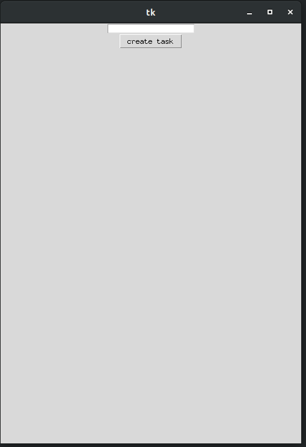
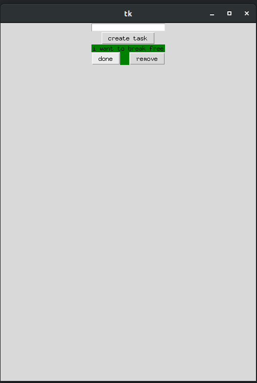
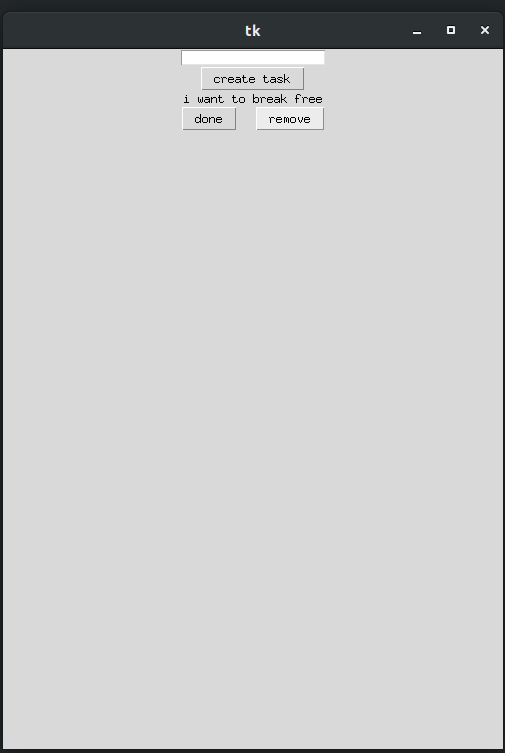

# Todopy
A simple todo app that you can use to keep track of your task

## How to run
Just follow the instructions below to run and use the app.

### first run the main.py file
```
python main.py
```

### press the create task button to add task


### press done to mark it as done and remove to remove the task




